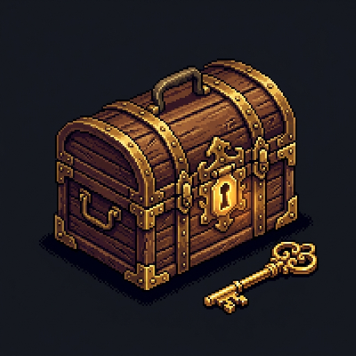

<p align="center">
  
</p>

<h1 align="center">PasStash - Secure Password Vault</h1>

<p align="center">
  <strong>A fully offline desktop password manager that keeps your secrets safe.</strong>
</p>

---

## About

**PasStash** is a desktop application that securely stores your personal passwords and sensitive information on your local machine. All data is protected with **AES-256-GCM** military-grade encryption and never leaves your computer.

> *"Your vault, your key, your secrets."*

---

## Features

| Feature | Description |
|---------|-------------|
| **AES-256-GCM Encryption** | All data is encrypted with military-grade standards |
| **Login Credentials** | Store usernames, passwords, and URLs |
| **Secure Notes** | Safely save sensitive text notes |
| **Card Information** | Protect your credit/debit card details |
| **Server Credentials** | SSH, FTP, and other server access info |
| **Favorites** | Quick access to frequently used entries |
| **Password Generator** | Customizable strong password generator |
| **Export / Import** | Backup in `.stash` (encrypted) or `.json` format |
| **Modern UI** | Clean, bright, retro-themed design |

---

## Installation

### Pre-built Executable (Recommended)

1. Download the latest release from the [Releases](https://github.com/msehitsevim/passtash/releases) page
2. Run `PasStash.exe`
3. Create a master password and start using it!

### Build from Source

```bash
# Clone the repository
git clone https://github.com/msehitsevim/passtash.git
cd passtash

# Build and run
dotnet run --project PasStash

# Publish as self-contained executable
dotnet publish PasStash/PasStash.csproj -c Release -r win-x64 --self-contained true -o publishes
```

### Requirements

- **OS:** Windows 10/11
- **To build:** [.NET 10 SDK](https://dotnet.microsoft.com/download)
- **To run:** No additional installation needed with self-contained build

---

## Architecture

```
PasStash/
├── Core/
│   ├── Models/          # Data models (VaultItem, VaultData)
│   └── Services/        # Business logic (VaultStorageService)
├── ViewModels/          # MVVM ViewModel layer
├── Views/               # WPF user interface
│   ├── VaultView.xaml   # Main vault view
│   └── Converters.cs    # Value converters
├── Styles/
│   ├── Colors.xaml      # Color palette
│   ├── Controls.xaml    # Custom control styles
│   └── Icons.xaml       # Vector icons
├── App.xaml             # Application entry point
└── MainWindow.xaml      # Main window
```

- **Pattern:** MVVM (Model-View-ViewModel)
- **Encryption:** AES-256-GCM with PBKDF2 key derivation
- **Storage:** `%LocalAppData%\PasStash\passtash.dat`

---

## Security

- **AES-256-GCM** encryption standard
- **PBKDF2** key derivation (brute-force protection)
- **Fully offline** - no cloud connection
- **Local storage** - data stays on your machine only
- **Open source** - full code transparency

---

## Tech Stack

- **Language:** C# 13
- **Framework:** .NET 10
- **UI:** WPF (Windows Presentation Foundation)
- **Encryption:** System.Security.Cryptography (AES-GCM)

---

## License

This project is licensed under the [MIT License](LICENSE).